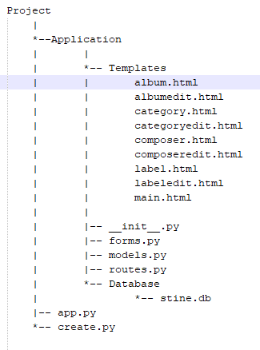
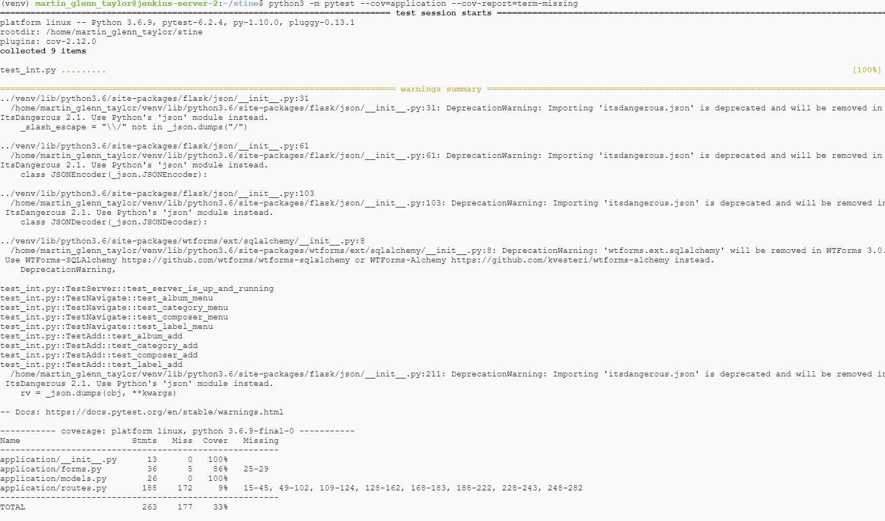
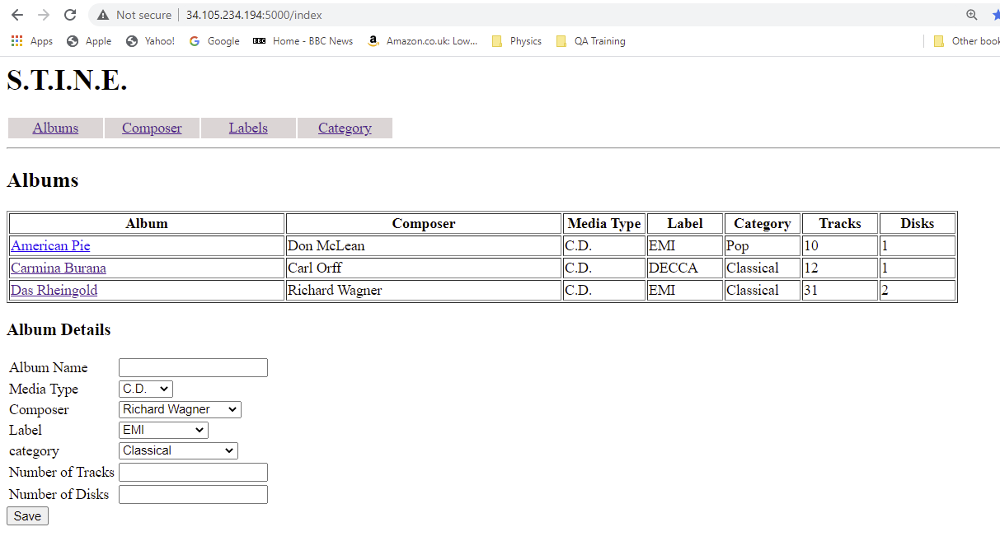
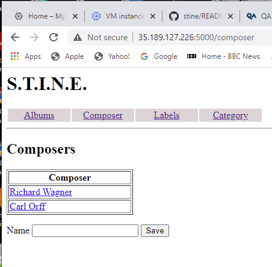

# STINE - Some Times Itunes is Not Enough

## Contents
* Brief Overview of the projet
* ERD and Detailed discussion on the data stored
* Application design and description
* CD/CI Intergation - Using Jenkins to install from GITHUB and executing the application
* Project Tracking
* Risk Assessment
* Testing
* Applications screen shots
* Known Issues
* Conclusions

## Brief
The following is a brief outling of the STINE application. STINE is intend to be a simple to use database, that
allowes audiophile to record basic information on their audio collection. The project indentified key data elements
of interest, and based of these requirements design a simple/easy to use GUI and underlying database structure.

## Techincal Elements
Whilst executing the project:
* User stories where created and managed on the JIRA platform
* The User Interface will be a WEB front end.
* The Application will be designed and deployed as a WEB/Cloud bassed system.
* Relational Databases are utilised to store data: SQLITE for Dev, GCP based MySQL for Prod.
* Documentation had been either created before a task, or appended after the task.
* Programming best practices have been followed when using PYTHON, FLASH, HTML, JINGA2, etc
* GITHUB has been used as a code repository: [GITHUB](https://github.com/martingtaylor/stine)

## ERD and Description of the Project
Following formal meetings with potiental users of STINE, a number of key data elements where identified as useful 
to a collector of audio media, these included:
* Name/title of Album
* Composer
* Artist
* Performers
* Type (Vynal/CD)
* Label
* Date Recorded
* Category (Classical, Jazz, Rock, Blues, etc)
* Compliation
* Number of Tracks
* Number of disks
* Duration
* Digital/Analog

Following normalisation, the data elements where grouped in a number of seperate tables:
* ALBUM - the central table contain either base data or links to other tables.
* COMPOSERS - A table containing the names of individual composers. 
* MEDIA_TYPES - A list of the basic media types: C.D., Vinyl, Digit. This table is considered non changing.
* LABELS - A list of media publishers.
* CATEGORIES - A list of musical type, such as Jazz, Classical, Country, etc.

All these tables form a Many-to-One relationship with the central Ablum table:
|Table      |Relationship                                      |
|-----------|--------------------------------------------------|
|COMPOSERS  |One composers relates to none, one or many Albums |
|MEDIA_TYPES|One Media Type relates to none, one or many Albums|
|LABELS     |One Label relates to none, one or many Albums     |
|CATEGORIES |One category relates to none, one or many Albums  |

As can be seen, the creates a simple star structure with the Albums table in the centre.

The following ERD diagram shows the originally intended structure:

### Revision History:
It should be noted that due to time constraits a number of non-key data items have been dropped from the final implementation.

These include:
|Drop Field          |
|--------------------|
|Artist              |
|Conductor           | 
|Data Recorded       |
|Digital Analog      |
|Compilation Flag    |
|Run Time            |

All of the above fields are fields within the Albums tables and can ommited without affecting the overal design or function.
All these fields could be easily be added to the application, time permitting.

Removing the unimplemented fields gives a revised ERD diagram:

## Application design description
### Overview
The techincal brief defined a number of tools/techniques/frameworks to employ on this project:
* Cloud based production system: GCP
* Databases: SQLITE for Dev, MySQL for Prod
* WEB Interface
* Development Language: PYTHON
* Interface: WEB using HTML

### Frameworks
To achieve a reliable WEB based, database application using PYTHON, the following frameworks where selected for reliablity and robustness:
|Frameworks|Description|
|----------|-----------|
|SQLAchemy |A PYTHON base interface to backend database layers|
|FLASK     |WEB Services framework for PYTHON|
|WTForms   |WEB Forms Management software|
|JINGA2    |WEB/PYTHON interaction framework|

### Application Design
It was desided to keep the application user exprienance as simple as possible, using the same working methodology to all interfaces. The number of interfaces should be mininal, with easy context switching using a standard menu available on each interface screen.

The application included a seperate interface for each data table defined in the ERD. This includes:
* The main Album
* The music category
* The Composer
* The Pusblisher Labels

NOTE: the Media Type table is created is not alterable by design, and is populated when the database is deployed.

In addition to the interfaces, a simple menu system is included to context switch to each of the screens. The menu is imbedded with the main.html page, which includes a JINGA2 block, inwhich all other html pages are embedded. This approah makes the menu available to all interfaces.

The following directory structuer was used to host the application:

### Applcation Execution
As with most PYTHON WEB application demonstrated - application is invoked by running the app.py, which imports the code from the application directory and if running at main, invokes the __init__.py code. 

The __init__.py loads the base set of imports, setups the environmental variables (containing the connection and secret key strings), and finally runs the routes.py code.

The routes.py is executed on receipt of a WEB requests and drives the application execution. The code contains two routines associated with each GUI:
1. _interface_ route which drives the listing of that table (R - of CRUD) and the addition function (C - of CRUD). This screen contains a hyperlink on each displayed item, which links to the _interface-edit_ route.
2. _interface-edit_ route appears much like the _interface_ but offers the user the ability to change the selected item (U - of CRUD), or delete (D of CRUD)

|Interface|Route for Read/Add|Route for Update/Delete|
|---------|------------------|-----------------------|
|Album    |/ or index        |albumedit              |
|Composer |composer          |composeredit           |
|Label    |label             |labeledit              |
|Category |category          |category               |

All Routes for Read/Add function is the same manner, as do all Update/Deletes.

#### Read/Add:
* For GET and POST methods - query the relevant table and create a list of data items. Set the form type. Clear the error message.

* For POST mehtods only (Add and new item): 
1. Collect the data from the form.
2. Check the relevant table and see if it already exists. And if not:
3. Add the new item to the table and refresh the all data list (now includes new item).
4. If item already exists - set the appropriate error message.

* Finally - render the appropriate HTML page with the new all data list and error message.

#### Update/Delete:
* The item id (database primary key) is passed down to from the HTML page.
* For GET and POST methods - query the relevant table and create a list of data items. Set the form type. Clear the error message.

* For GET requests only:
1. Look up the item from the relevant table using the given id. If found:
2. Populate the form the database items found.
3. If not found - error.

* For POST requests only:
1. For Save request:
2. Locate the orignal table entry for this ID. If exists
3. Change the data value to the one supplied from the form.
4. Commit to database - effecting a change/update
5. Redirect back to the non edit route.
6. If not found - error.
7. For Delete request:
8. Locate the orignal table entry for this ID. If exists
9. Delete this item from the table.
10. Redirect back to the non edit route.
11. If not found - error.

## CD / CI Integration
### Development Cycle:
The application was developed and deployed using the following CI methodology:
1. A public GITHUB repository was created for the STINE account containing this README.md
2. The repository was cloned to the development PC.
3. Microsoft Visual Studio Code 1.56 was connected to the STINE GIT repository.
4. During the development cycle, regular commits where made to the main branch repo.

### Jenkins Deployment:
When Jenkins "Build" is invoked:

1. Jenkins query the user to select on the choice of MYSQL or SQLITE database types and whether to recreate the database.

3. On execution - Jenkins downloads the latest STINE GIT main branch and deploy to a Jenkins Workspace.
4. Set the Database connection string (based on the choice made above) and store to an environmental variable.

**NOTE:** It should be noted that 3 lines in the build relating to the installation (requirements, pymysql, gunicorn) have been
commented out. This was due to these items crashing the build process. These items where installed on the command line using sudo
to get around this problem, and I will investigate this issue later.

4. Check the **CREATEDB** environmental variable, and if set to true, run the **CREATE.PY** program to drop and recreate the database on the selected database.
5. Invoke the **GUNICORN** WEB Host and execute the application.

The following log was generated once during the Build process:

**NOTE:** The following change was made to the Jenkins server to enable the Jenkins user to execute apt commands as sudo

## Project Tracking
The JIRA Project Management tool was used to track and manage the application during the development, testing deployment cycle:

The JIRA configuration allows:
* Management of the "To-Do list" - user stories, summarising "Who Wants", "What they Want" and "What they except"
* The "In progress" - containing items currently being worked on, or blocked items.
* The "Done List" - Items that have been completed and tested, or approved.

## Risk Assessment
An initial Risk Assessment was completed on project commencement:

Revision History: Since then the assessment has been revised on a number of occassions:
|Date      |Item|Title                      |Description|New Likihood|
|----------|----|---------------------------|-----------|------------|
|03/05/2021|4   |Legal Constraints          |As the system was for private and non profit use only and does not contain actual audio media data, this can be dismissed.|Dissmed|
|19/05/2021|2   |Lack of technical Knowledge|Due to lack of techincal knowledge, was unable to default selection boxs to stored values.                                |Very Probable|
|19/05/2021|5   |System failes User Test    |Due to select fields not default, user testing will fail                                                                  |Very Probable|

## Testing
### Unit Tesing:
Created a series of PYTEST / FLASK unit tests that exercised both GET and POST for each main and edit routes. All GUIs are tested by looking for dummy data (for example the Composers table contains a single entry "Test Composer", the labels "Test Label", the Catergories "Test Category") created after the test routine starts, that is being returned by a call to either the full list, or the via the id supplied. All test looks for a 200 return code (got the WEB page back successfully) and the presents of the expect text.

Happy to say we achieve an overal coverage of 72%

I have included a link to the PYTEST code: [PYTEST.PY CODE](https://github.com/martingtaylor/stine/blob/main/test_app.py)

#### Anaylist of Coverage
I then ran the pytest **--cov=app --cov-report=term-missing** to find the code that had been missed:
|Code|Stmts|Miss|Cover|Missing|
|----|-----|----|-----|-------|
|application\routes.py|198|62|69%| 78-91, 95-101, 123, 140, 145-152, 156-162, 182, 200, 205-212, 216-222, 242, 260, 266-273, 277-283

Lines 123, 140, 182, 200, 242, 260 - Are all related to Error reports, and require a test condition to try and access a non existing row.

The others relate to POST Updates and Deletes, which haven't yet been tested.

### System Integration Testing:
Created an integration script to exercise:
* The WEB GUI menues
* Creating new Categories, Labels, Composers

The test script can be viewed at [PYTEST INT](https://github.com/martingtaylor/stine/blob/main/test_int.py)

When run, the routines covered 32% of the application.

**NOTE:** Unfortunately I ran out of time to continue writing testing scripts. Hopefully these can be added soon.

## Application Screen Shots

### Album GUI:

### Composer GUI:

### Label GUI:

### Category GUI:

## Known Issues
1. When an Album is retrieved to the Album GUI, the Selection drop downs do not change to the appropriate values.
2. It is possible to save an Album with a blank name.

## Future Enhancement
1. The all lists should be alphabetically sorted.
2. Additional descoped field should be added.

## Conclusions
The STINE application does not run as specified, in that the main Album GUI does not refresh the select field items with the correct item when reloading previously saved data. I feek confident that this problem could be solved given more time and experimentation. However, the other tables (Composer, Label and Category) do all demostrate the succesfully perform standard CRUD actions.

